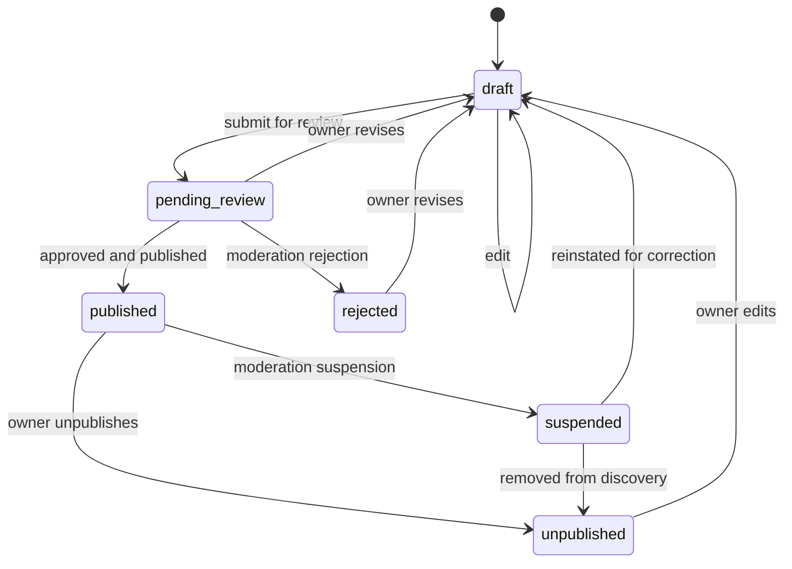
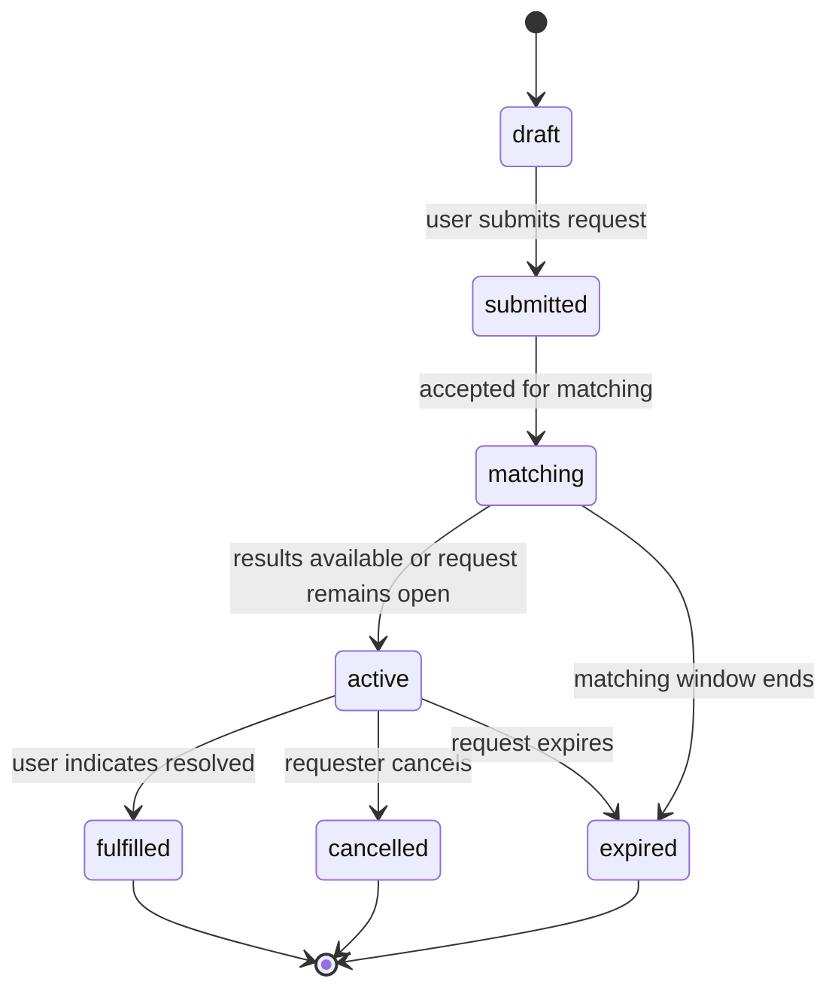
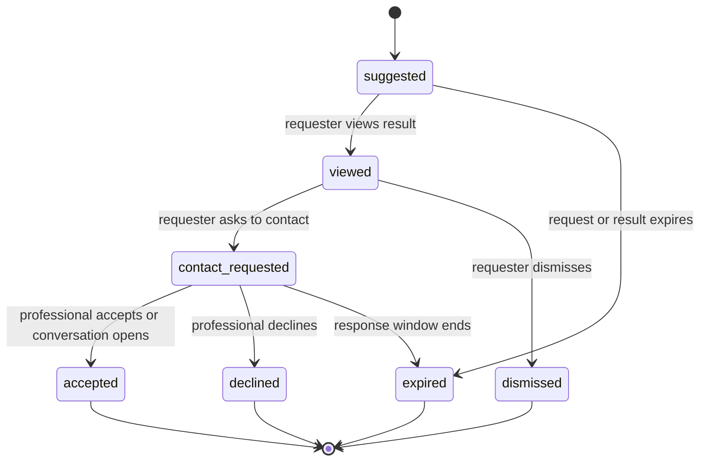
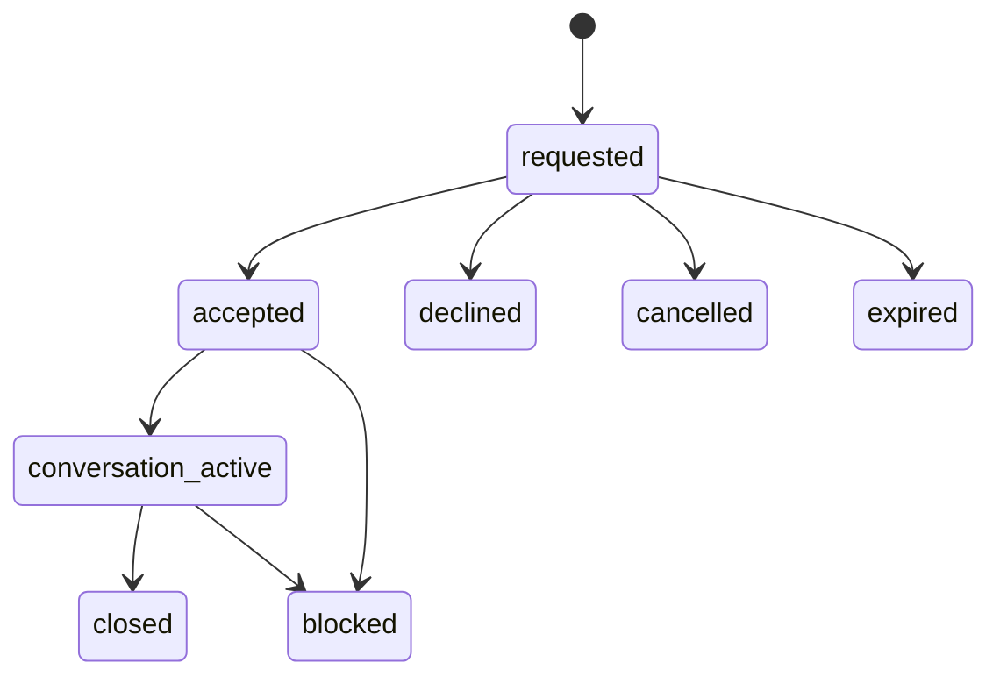
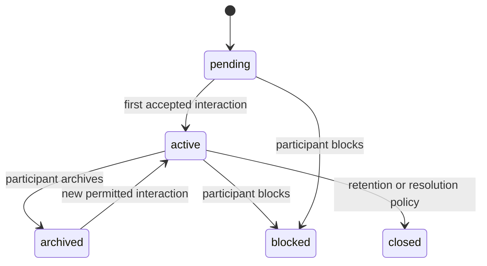

# Domain Lifecycles

These states define externally meaningful behavior. The eventual database schema and APIs must preserve these rules or propose an approved change.

## Professional profile

Rules:

- only the owner can edit a draft;
- only an explicit publish action makes a profile discoverable;
- rejected, unpublished, or suspended profiles are excluded from search;
- public readers see a published projection, not private owner fields;
- publishing must be auditable.

## Service request

Rules:

- the original request text is immutable after submission or stored as a version;
- AI extraction may be corrected without rewriting the original request;
- a request may have zero, one, or many matches;
- matching failure must be observable and must not fabricate professionals.

## Match

The match score and ranking version are operational evidence, not a promise of quality.

## Contact request

## Conversation

Blocking is a security rule enforced on every relevant backend operation. Archiving is a presentation/state-management action and does not necessarily delete messages.
